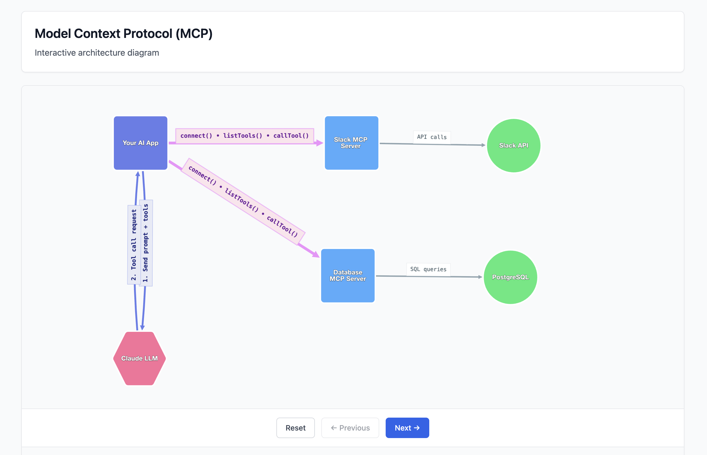

# Introduction to MCP

These days software often benefits from integrating with LLMs. When you build an AI app, you might want it to interact with external services—send Slack messages, read Google Drive files, query databases. These integrations are called "tools."

## The Problem MCP Solves

Before MCP, you have to write custom integration code for every service you want to connect.

**MCP fixes this.** If a service provides an MCP server, your app gets the integration for free.

---

### Before MCP

You write this integration code:

```javascript
import { WebClient } from "@slack/web-api";

const slack = new WebClient(process.env.SLACK_TOKEN);

// Define tool for Claude
const slackTool = {
  name: "send_slack_message",
  description: "Send a message to Slack",
  input_schema: {
    type: "object",
    properties: {
      channel: { type: "string" },
      text: { type: "string" }
    }
  }
};

const response = await anthropic.messages.create({
  model: "claude-3-5-sonnet-20241022",
  tools: [slackTool],
  messages: [{ role: "user", content: "Send 'Hello' to #general" }]
});

// Handle the tool call yourself
if (response.stop_reason === "tool_use") {
  const toolUse = response.content.find(c => c.type === "tool_use");

  // You write the Slack integration logic
  await slack.chat.postMessage({
    channel: toolUse.input.channel,
    text: toolUse.input.text
  });
}

// Now repeat this for Google Drive...
// And again for your database...
// And again for every service...
```

---

### With MCP

Slack provides the server, you just use it:

```javascript
import { Client } from "@modelcontextprotocol/sdk/client";

// Connect to Slack's MCP server (they wrote the integration)
const mcp = new Client();
await mcp.connect(slackMCPServer);

// Get tools automatically
const tools = await mcp.listTools();

const response = await anthropic.messages.create({
  model: "claude-3-5-sonnet-20241022",
  tools: tools, // Slack tools ready to use
  messages: [{ role: "user", content: "Send 'Hello' to #general" }]
});

// Standard tool call - MCP handles Slack API for you
if (response.stop_reason === "tool_use") {
  const toolUse = response.content.find(c => c.type === "tool_use");

  await mcp.callTool({
    name: toolUse.name,
    arguments: toolUse.input
  });
  // MCP server does the actual Slack API call
}

// Add Drive? Just connect another MCP server, same code pattern
// Add database? Same thing
```

---

## Key Takeaway

For tools that support MCP, you don't have to write API integration. You don't define the tool schema. You just connect and use the tool.

---

## Architecture



[View the interactive walkthrough](https://jcarras.github.io/simple-mcp-walk-through)
